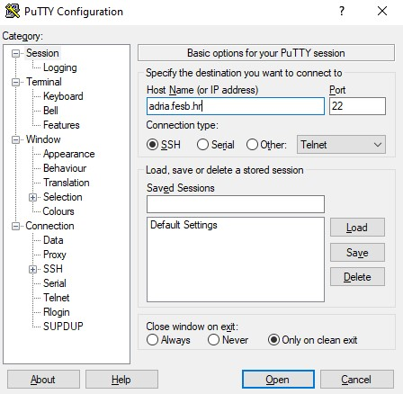
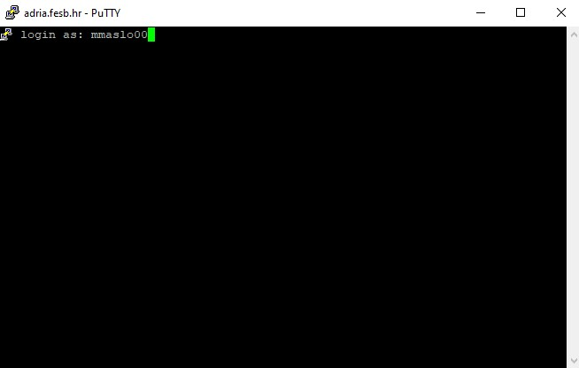
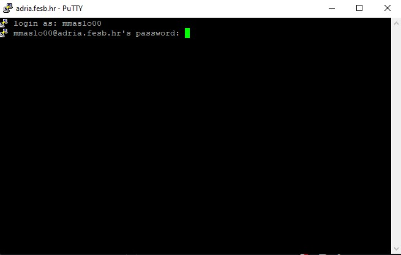
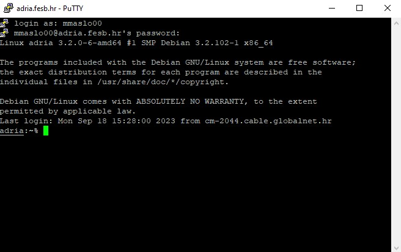

# 🚀 Priprema za vježbe: Osnove korištenja UNIX ljuske

## Zadatak 📋
U okviru vježbe potrebno je spojiti se na `adria.fesb.hr` preko programa Putty.

Nakon uspješnog spajanja u svojem korisničkom direktoriju napravite direktorij `unix`˙(`~/unix`).

Na direktoriju `unix` postavite sljedeća prava pristupa:
- <b>vlasnik:</b> sva prava pristupa
- <b>grupa:</b> pravo čitanja i izvršavanja
- <b>ostali:</b> pravo čitanja i izvršavanja

U direktoriju `unix` korištenjem `joe` editora stvorite datoteku `vjezba.txt`, te joj postavite sljedeća prava pristupa:
- <b>vlasnik:</b> pravo čitanja i pisanja
- <b>grupa:</b> pravo čitanja
- <b>ostali:</b> pravo čitanja

U datoteku `vjezba.txt` unesite sve naredbe korištene u ovoj vježbi.

Konačno, direktorij u kojem ste odradili vježbu komprimirajte u .tar datoteku te istu učitajte na Merlin.

___

## Upute 🧭
```
💡 Kada znate naredbu, ali ne znate kako je koristiti možete se poslužiti s: man [naredba]
```
### 1. Korištenje programa Putty 💻
Kada otvorite program Putty, potrebno je unijeti adresu `hosta` na kojeg se spajate, u našem slučaju je to `adria.fesb.hr`. Bitno je da je odabrani `port` 22 i da je `Connection Type` SSH.



Kada ste sve upisali, kliknite na `Open`. Sada će vam se otvoriti terminal i tražit će vas se korisničko ime.



Kada uneste korisničko ime i pritisnete `Enter` tražit će vas se lozinka.



Prilikom upisivanja lozinke neće se pojavljivati nikakvi znakovi na terminalu! Kada loziknu upišete pritisnite `Enter`. Ako je autentifikacija prošla, otvorit će vam se vaš `home` direktorij.



### 2. Navigacija među direktorijima 🗂️
Kada se preko Puttyja spojite na server bit ćete pozicioniran u svoj `home` direktorij:
``` bash
adria:~%
```
Kada niste sigurni gdje se trenutno nalazite, tj. u kojem ste direktoriju, možete koristiti naredbu `pwd`, koja će ispisati apsolutnu putanju direktorija u kojem se trenutno nalazite:
``` bash
adria:~% pwd
/home/mmaslo00
```
Za izlistavanje svih direktorija koji se nalaze u trenutnom direktoriju (u ovom slučaju `home`), možete koristiti naredbu `ls` ili `ls -l`.
Naredba `ls` će izlistati direktorije:
``` bash
adria:~% ls
Maildir      public_html2  unix.tar   vjezba2    vjezba3_1    vjezba6
microGram    unix          vjezba1    vjezba2_2  vjezba3.tar  vjezba6_a
public_html  unix1         vjezba1_2  vjezba3    vjezba5      vjezba7
```
dok će naredba `ls -l` izlistati direktorije i dodatne informacije o njima (prava, broj datoteka/direktorija, vlasnika, grupu, veličinu, datum zadnjeg uređivanja i naziv):
``` bash
adria:~% ls -l
total 148
drwxr-xr-x 2 mmaslo00 stud  4096 Sep 12  2016 Maildir
drwxr-xr-x 6 mmaslo00 stud  4096 Jan 20  2019 microGram
drwxr-xr-x 2 mmaslo00 stud  4096 Jan 21  2019 public_html
drwxr-xr-x 2 mmaslo00 stud  4096 Oct 18  2022 public_html2
drwxr-xr-x 2 mmaslo00 stud  4096 Oct 18  2022 unix
drwxr-xr-x 2 mmaslo00 stud  4096 Oct 18  2022 unix1
-rw-r--r-- 1 mmaslo00 stud 10240 Oct 18  2022 unix.tar
drwxr-xr-x 2 mmaslo00 stud  4096 Oct 25  2022 vjezba1
drwxrwxrwx 2 mmaslo00 stud  4096 Oct 24  2022 vjezba1_2
drwxr-xr-x 3 mmaslo00 stud  4096 Nov  8  2022 vjezba2
drwxr-xr-x 2 mmaslo00 stud  4096 Nov  8  2022 vjezba2_2
drwxr-xr-x 2 mmaslo00 stud  4096 Nov 15  2022 vjezba3
drwxr-xr-x 2 mmaslo00 stud  4096 Nov 15  2022 vjezba3_1
-rw-r--r-- 1 mmaslo00 stud 71680 Nov 15  2022 vjezba3.tar
drwxr-xr-x 2 mmaslo00 stud  4096 Dec 12  2022 vjezba5
drwxr-xr-x 2 mmaslo00 stud  4096 Dec 20  2022 vjezba6
drwxr-xr-x 2 mmaslo00 stud  4096 Dec 19  2022 vjezba6_a
drwxr-xr-x 3 mmaslo00 stud  4096 Jan 10  2023 vjezba7
```
"Ulazak" u i "izlazak" iz direktorija vrši se naredbom `cd`:

Ulazak `cd <ime_direktroija>`:
``` bash
adria:~% cd microGram/
adria:~/microGram%
```

Izlazak `cd ..`:
``` bash
adria:~/microGram% cd ..
adria:~%
```

### 3. Stvaranje i brisanje direktorija 📁

Direktoriji se na UNIX okruženjima stvaraju korištenjem `mkdir` naredbe na sljedeći način:
``` bash
mkdir <ime_direktroija>
```
Primjer:
``` bash
adria:~% mkdir test1
adria:~%
```
Provjera je li direktroij stvoren:
``` bash
adria:~% ls
Maildir      public_html2  unix1     vjezba1_2  vjezba3      vjezba5    vjezba7
microGram    test1         unix.tar  vjezba2    vjezba3_1    vjezba6
public_html  unix          vjezba1   vjezba2_2  vjezba3.tar  vjezba6_a
```
Vidimo da postoji direktorij `test1`.

Brisanje direktorija (i datoteka) se vrši korištenjem naredba `rm` uz argument `-rf` (za datoteke nije potreban taj argument).
``` bash
adria:~% rm -rf test1/
adria:~%
```
### 4. Stvaranje i brisanje datoteka 📃
Datoteke se mogu stvoriti na više načina. Osnovna naredba za stvaranje datoteka je `touch`:
``` bash
touch <ime_datoteke>.<ekstenzija>
```
Osim korištenja naredbe `touch` za stvaranje datoteka možete koristiti i razne editore koji su vam na okruženju dostupni (vim, nano, joe). Kroz vježbe će koristit `joe` editor pa ćemo pomoću njega pokazati primjer:
``` bash
joe <ime_datoteke>.<ekstenzija>
```
Kada izvršite ovu naredbu otvorit će vam se joe editor, te u datoteku možete upisati što želite. Kako biste spremili promjene i izašli iz joe editora pritisnite `ctrl` + `K` + `X` (odjednom).

❗ Napomena:

Naredba:
``` bash
joe <ime_datoteke>.<ekstenzija>
```
ne služi samo za stvaranje datoteka, to je naredba za otvaranje datoteka u joe editoru, no u slučaju kad datoteka ne postoji joe će je i stvoriti prilikom spremanja. To znači da ako datoteku stvorite pomoću `touch` naredbe, možete je otvoriti i u nju pisati pomoću `joe` naredbe.

Brisanje datoteka je slično brisanju direktorija samo što nije potrebno dodavati argument `-rf`:
``` bash
adria:~% rm test1
adria:~%
```

### 5. Postavljanje prava na datoteke / direktorije ⛔
Prava na datoteke i direktorije se dodaju korištenjem naredbe `chmod` na 2 načina:

#### 1. Način
``` bash
chmod [V][G][O] <ime_datoteke>
ili
chmod [V][G][O] <ime_direktroija> -R
```
Primijetite da direktorij (ako nije prazak) zahtijeva argument `-R`, slično kao i kod brisanja direktroija (`-rf`). Taj argument naznačava da je potrbno naredbu rekurzivno izvršiti nad svim datotekama i direktorijima koji se nalaze u trenutnom dirketorij (tj. onom nad kojim vršimo naredbu).

`[V][G][O]` su 3 broja čije značenje slijedi:
- `V` (prvi broj): prava vezana za vlasnika
- `G` (drugi broj): prava vezana za grupu
- `O` (treći broj): prava vezana za ostale

Brojevi se određuju prema sljedećoj tablici:

| # | Prava                          | rwx |
|---|--------------------------------|-----|
| 0 | ništa                          | 000 |
| 1 | samo izvršavanj                | 001 |
| 2 | samo pisanje                   | 010 |
| 3 | pisanje i izvršavanje          | 011 |
| 4 | samo čitanje                   | 100 |
| 5 | čitanje i izvršavanje          | 101 |
| 6 | čitanje i pisanje              | 110 |
| 7 | čitanje, pisanje i izvršavanje | 111 |

Dakle, dekadski broj se određuje preko binarnog gdje su tri znamenke binarnog broja zapravo prikaz r (read), w (write) i x (execute) prava. Ovisno o pozicijama 0 i 1 poznato je koja su prava u pitanju.

Primjer:
``` bash
chmod 720 test.txt
```
Naredba poviše postavlja sljedeća prava:
- vlasnik: čitanje, pisanje i izvršavanje
- grupa: samo pisanje
- ostali: ništa

#### 2. Način
``` bash
chmod [referenca][operator][mod] <ime_datoteke>
ili
chmod [referenca][operator][mod] <ime_direktroija> -R
```
Referenca predstavlja sljedeće: vlasnika `u`, grupu `g` ili ostale `o`.
Operator definira dodajemo li `+` ili oduzimamo li `-` prava referenci. Osim `+` i `-` može se koristit i `=` za eksplicitno postavljanje određenog prava.
Mod se odnosi na pravo koje dodjelujemo: `r`, `w` ili `x`.

Primjei:
Ako želimo vlasniku datoteke dodijeliti prava čitanja izvršavamo naredbu na sljedeći način:
``` bash
chmod u+r test.txt
```
Ako želimo vlasniku datoteke oduzeti prava pisanja izvršavamo naredbu na sljedeći način:
``` bash
chmod u-w test.txt
```
Ako želimo vlasniku i grupi dodati prava čitanja i pisanja izvršavamo naredbu na sljedeći način:
``` bash
chmod ug+rw test.txt
```
Ako želimo svima (eksplicitno) dodati prava čitanja i pisanja možemo izvršiti naredbu na sljedeći način:
``` bash
chmod a=rw test.txt
```
(a označava all)

Provjeru prava nad datotekama ili direktorijima možete izvršiti naredbom `ls -l`.

### 6. Komprimiranje: Stvaranje `.tar` datoteka 🗜️
Kako biste komprimirali određeni direktorij koristi se naredba: `tar` s argumentom `-cf`, na sljedeći način:
``` bash
tar -cf test.tar test
```
`test.tar` je ime nove `.tar` datoteke koju stvaramo, a `test` je ime direktorija kojeg komprimiramo. Ono što je potrebno naglasiti je da se trebate nalaziti izvan direktorija `test`.

Primjer:
``` bash
tar -cf test.tar test
```
˙Pogledajmo je li se `.tar` datoteka stvorila (`ls -l`):
``` bash
adria:~% ls -l
drwxr-xr-x 2 mmaslo00 stud  4096 Sep 18 15:28 test
-rw-r--r-- 1 mmaslo00 stud 10240 Sep 18 15:29 test.tar
```

### 7. Korištenje programa WinSCP 🌐
Slično kao i kod Puttyja, prijavite se u svoj adria.fesb.hr račun. Umjesto terminala prikazat će vam se explorer gdje jednostavno možete pronaći vašu `.tar` datoteku na desnom prozoru i prebaciti je na lijevi prozor (vaše lokalno računalo).
